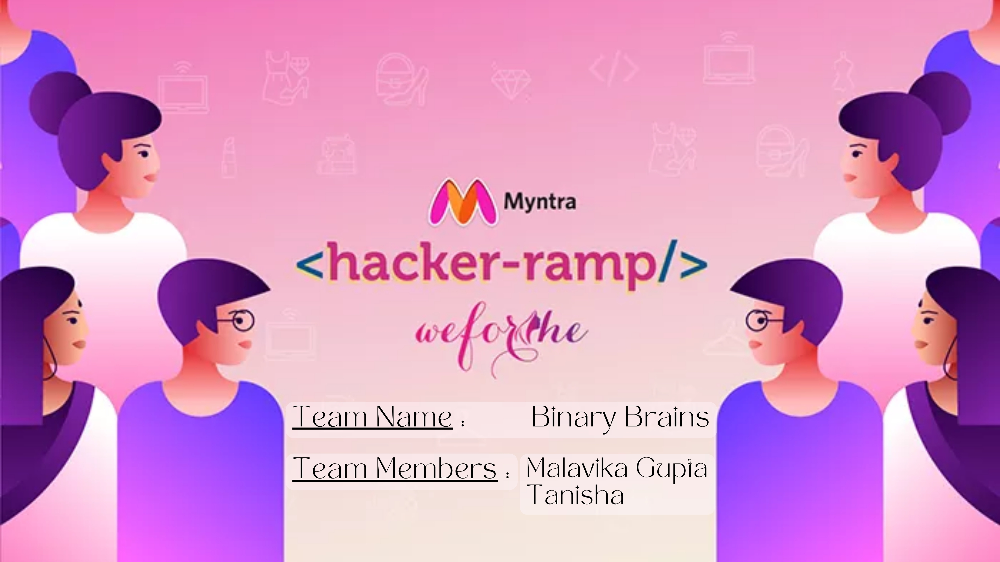

# Myntra TrendCraft

Welcome to Myntra TrendCraft, a prototype project developed for the Myntra WeForShe Hackathon. This project combines frontend development with machine learning to predict fashion trends and enhance user engagement on the Myntra platform.

## Description
Myntra TrendCraft is a prototype for the WeForShe Hackathon, merging frontend development with machine learning to predict fashion trends. Users style virtual models with a variety of clothing and accessories, utilizing AI for trend forecasting, enhancing user engagement in fashion exploration.

## Table of Contents
- [Project Overview](#project-overview)
- [Features](#features)
- [Tech Stack](#tech-stack)
- [Installation](#installation)
- [Usage](#usage)
- [Data Analysis](#data-analysis)
- [Model Training](#model-training)
- [Frontend Development](#frontend-development)
- [Future Enhancements](#future-enhancements)
- [Contributing](#contributing)

## Project Overview
Myntra TrendCraft is designed to bring a seamless and interactive experience for users by allowing them to dress up virtual models and see predicted fashion trends. The project aims to utilize AI for better user engagement and satisfaction.

## Features
- **Virtual Model Dressing:** Users can select and dress up virtual models with various clothing items and accessories.
- **AI-Driven Trend Prediction:** Machine learning models predict upcoming fashion trends.
- **Interactive UI:** A user-friendly interface that enhances the styling experience.

## Tech Stack
- **Frontend:** HTML, CSS, JavaScript
- **Backend:** Python, Flask
- **Machine Learning:** Scikit-learn, Pandas, NumPy

## Installation
To run this project locally, follow these steps:

1. Clone the repository:
   ```sh
   git clone https://github.com/your-username/myntra-trendcraft.git
   ```
2. Navigate to the project directory:
   ```sh
   cd myntra-trendcraft
   ```
3. Install the required dependencies:
   ```sh
   pip install -r requirements.txt
   ```

## Usage
1. Run the backend server:
   ```sh
   python TrendPrediction.py
   ```
2. Open `index.html` in your web browser to start using the web page.

## Data Analysis
The project includes a comprehensive data analysis and cleaning process to ensure the accuracy and reliability of the predictions. We used various visualization techniques to understand the data distribution and outliers.

## Model Training
Multiple regression models were trained and evaluated to predict fashion trends, including Linear Regression, Support Vector Regression, Decision Tree Regression, and Random Forest Regression.

## Frontend Development
The frontend includes a sleek and interactive interface where users can select clothing items for virtual models. The styling and design are aimed at providing an enjoyable user experience.

## Future Enhancements
- Integration with real-time trend data from social media and fashion websites.
- Personalized recommendations based on user preferences.
- Enhanced visualization for trend predictions.

## Demo Video
[](https://drive.google.com/file/d/1KlVQHs8lNikoSVge9v3NNRt_EfXkzK-s/view?usp=drive_link)

## Contributing
Contributions are welcome! Please fork the repository and submit a pull request for any improvements or bug fixes.
